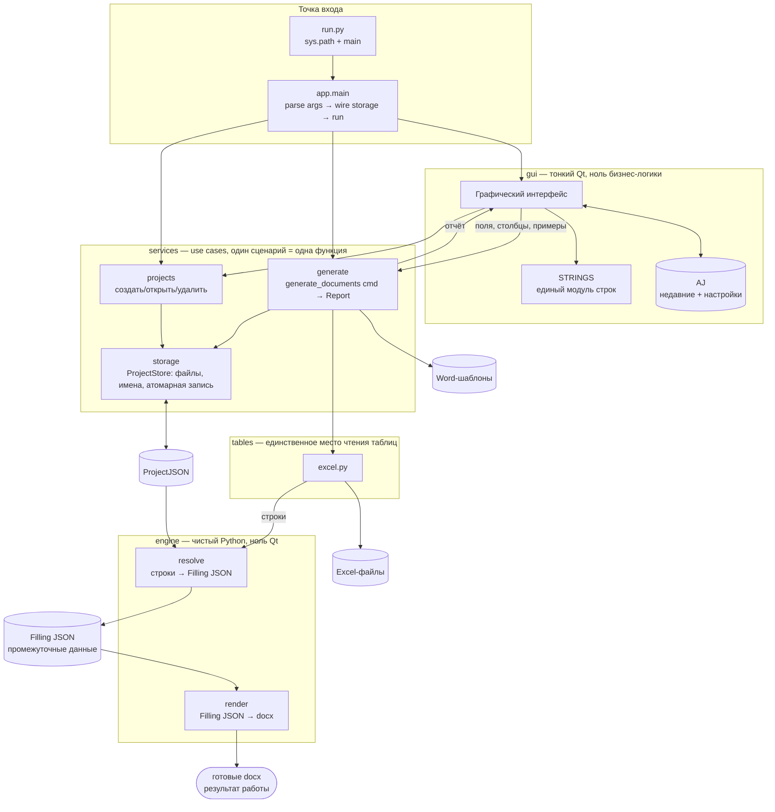

# Архитектура Stanok

> Единый источник правды по архитектуре. `AGENTS.md`, `specs/spec.md`
> и docstring-контракты пакетов (`src/stanok/*/`) содержат только краткие
> выжимки со ссылкой сюда. Детали меняются только здесь.

## Принципы

- **Один use case — одна функция.** Параметры вместо копий кода
  (например, режимы строк — параметр, а не копии пайплайна).
- **Конвейер со стадиями и DTO:** `строки → Filling JSON → docx`.
  Стадия не знает соседей; между стадиями — типизированные структуры,
  а не сырые dict'ы из Excel.
- **Версионированные форматы файлов:** каждый JSON имеет поле `version`;
  ломающее изменение = bump версии + миграция + тест миграции + запись
  в `CHANGELOG.md`.
- **Хранилища инжектируются:** движок принимает `ProjectStore`,
  `TableReader`, `LogSink` параметрами; никаких путей `~/.stanok`
  и диалогов внутри движка.
- **Контракты до параллельной работы:** сигнатура + тест контракта
  на каждую границу; `getattr`-флаги на межмодульных границах запрещены.
- **Сборка как код:** `scripts/build-exe.*` в репозитории, проверяются
  как код; в `.gitignore` — только артефакты (`dist/`, `build/`).

## Данные (JSON)

- **PJ** (`<имя>.stanok`, внутри JSON): конфиг проекта, поле `version`,
  словарь шаблонов, относительные пути. Подробно — раздел
  «Файл `<имя>.stanok`» ниже.
- **FJ** (Filling JSON): разрешённые данные одного документа
  (`{template, fields}`) — единственный вход рендера.
- **AJ** (`~/.stanok/settings.json`): недавние проекты + настройки,
  без шаблонов и счётчиков.
- Фикстуры тестов — `tests/json/<кейс>/`: xlsx + docx + filling.json + эталон.


### Сквозной поток данных («Сгенерировать»)

```
GUI --GenerateCommand--> services.generate
  --read--> tables (строки)
  --resolve--> engine.resolve (Filling JSON × N)
  --render--> engine.render (docx × N, pure)
  --write--> storage (Результат/, уникальные имена)
GUI <--Report-- (создано N, пропущено M + причины)
```

Excel пересекает границу ровно один раз; назад (в GUI) возвращаются только
отчёт и пути файлов, не сырые строки.

## Слои и границы

Правило зависимости: **gui → services → engine**; внутрь — можно,
наружу и вбок — нельзя. Нарушение = падение CI (`tests/test_layers.py`).

### Слой gui — тонкий адаптер

- Знает: services + единый модуль строк (все русские строки — в одном месте).
- НЕ знает: engine напрямую (только типы для аннотаций — `TYPE_CHECKING`),
  файловые пути проектов (только через `storage`).
- `QMessageBox` — только здесь; ниже — коды ошибок + `logging`.
- Связь GUI ↔ services — прямые вызовы, без очереди команд.

### Слой services (`src/stanok/services/`) — use cases

- Знает: engine + storage-интерфейсы.
- НЕ знает: Qt-виджеты, argv (это дело gui).
- Один публичный use case — одна функция с типизированными входом/выходом:
  `generate_documents(cmd) -> Report`, где `cmd` — dataclass,
  а не 7 позиционных аргументов.
- Ошибки — типизированные (`ProjectNotFound`, `NoData`), не сырые
  исключения движка наружу без обёртки с контекстом.

### Слой engine (`src/stanok/engine/`) — чистый Python

- Знает: типы PJ/AJ/FJ, таблицы-как-строки, XML.
- НЕ знает: Qt, диалоги, пути Home, Excel-файлы напрямую (только через
  `tables/`-бэкенд, инжектированный вызывателем), сеть.
- Запрещены импорты: `PyQt5`, `stanok.gui`, пути
  пользовательских каталогов (только переданные пути).
- Тест границы: `import stanok.engine` не тянет Qt; grep-гейт в CI.

### Инфраструктура (`tables/`, `storage`, `~/.stanok/`)

- `tables/` — единственное место чтения таблиц (сейчас Excel, позже csv/…).
  Backend-функции принимают явные пути к файлам и возвращают plain-строки.
- `storage` (`services/storage.py`) — единственное место файловых операций:
  уникальные имена, атомарная запись (tmp+rename с `.bak`), миграции.
- Путь Home (`~/.stanok/`) — одна константа в `storage`, в тестах
  подменяется на tmp-каталог. Рядом с exe и в репозитории ничего не пишется:
  логи, настройки и миграции живут только в `~/.stanok/`.

## Структура (`src/stanok/`)

```
src/stanok/
├── app.py            # bootstrap: parse args → wire storage → run, без side effects на import
├── engine/           # чистый Python, ноль Qt/GUI
│   ├── resolve.py    # строки → Filling JSON: одна семантика
│   ├── render.py     # Filling JSON → docx: ТОЛЬКО подстановка
│   └── xmlops.py     # run-merge, циклы (низкоуровневый XML)
├── services/         # use cases, по одному на сценарий
│   ├── generate.py  # сгенерировать документы
│   ├── projects.py  # создать/открыть/удалить проект, именованные конфиги
│   └── storage.py   # ProjectStore: файлы, уникальные имена, атомарная запись
├── gui/              # тонкий Qt: окна → вызовы services, ноль бизнес-логики
└── tables/           # бэкенды чтения (excel.py сейчас; csv/ — позже)
```

## Схема взаимодействия



## Принятые решения

1. **Имя файла конфига:** `<имя>.stanok`, внутри чистый JSON.
2. **Связь GUI ↔ services:** прямые вызовы, без очереди команд.
3. **Тест границ слоёв:** `tests/test_layers.py` с первого дня —
   падение при импорте Qt в engine и при обходе services.
 4. **Версия формата vs версия продукта:** единый счётчик. Версия
    приложения = версия формата: один `version` в `pyproject.toml`
    (`__init__.py` читает его из метаданных пакета, руками не дублируется),
    пишется в поле `version` каждого файла.
5. **Тест на мёртвый код с первого дня;** правило «одна семантика —
   одна функция».
6. **Спека до кода** (Status: draft → done), CHANGELOG ведётся в процессе.
7. **Изображения — out of scope:** нет типа поля `image`, нет вставки
   картинок в `xmlops`, нет упоминаний в FJ. Закреплено также в scope
   (`README.md`, `specs/spec.md` §1.2).

### Проблема 1. Старые проекты не открываются

Папка проекта прошлой версии (без `*.stanok`) должна давать
понятную ошибку, а не молчание или падение: «Создайте проект заново». Детект — 
при отсутствии `*.stanok`. Тест: фикстура такой папки → диалог, не исключение.

### Проблема 2. Ассоциация файлов в Windows

Двойной клик заработает только после регистрации расширения
(реестр/инсталлер); портативный exe регистрировать не может.
До инсталлера — инструкция «Открыть с помощью» в README/FAQ + иконка,
зашитая в exe. Задача на инсталлер — отдельная спека, не MVP.

### Проблема 3. Поддержка редакторов

`.stanok` неизвестен редакторам: подсветки/валидации из коробки нет.
Лечится документированием (`files.associations: {"*.stanok": "json"}`
в README для разработчиков) и командой `stanok validate <файл>`
(будущий CLI). Контент остаётся валидным JSON — `jq` и скрипты работают
без доработок.

### Проблема 4. Правила имён (Windows)

- Санитизация: `<>:"/\|?*`, control-chars, точки/пробелы в конце.
- Регистр: `Договор.stanok` и `договор.stanok` — один файл на Windows;
  сравнение имён всегда case-insensitive.
- Зарезервированные имена (`CON`, `PRN`, `NUL`, …): запретить явно
  с понятной ошибкой, иначе Windows молча сломает файл.
- Длина: запас под `MAX_PATH` (stem ≤ 100 символов).
- Коллизии: `(1)`, `(2)` для создаваемого; существующий не трогаем.

### Проблема 5. Версия формата внутри файла

Поле `"version"` равно версии приложения (единый счётчик, решение 4):
берётся из `pyproject.toml` и пишется в каждый файл. Неизвестная новая
версия → явная ошибка «обновите программу», а не парсинг мусора.
Каждая версия формата — тест round-trip.

### Проблема 6. Битые файлы

Guards с первого дня: битый JSON → диалог, не падение; запись —
атомарная через tmp+rename с `.bak`. Тесты на каждый guard.

### Проблема 7. Связь с миграцией в Home

Конфиг живёт в папке проекта, при открытии мигрирует
в `~/.stanok/<имя_папки>.stanok`, исходник удаляется; резолвер:
папка → именованный → Home. Переименование папки после миграции
разрывает связь — задокументированное ограничение.

### Проблема 8. Тесты и репозиторий

Фикстуры — текстовые `.stanok` (диффы читаются — преимущество перед xlsx).
Контрактные тесты схемы + тест границ слоёв (`tests/test_layers.py`).
`Результат/` — в `.gitignore` пользовательских проектов (рекомендация в доке, **не в репозитории**).

### Проблема 9. Безопасность чтения с диска

Строгая валидация схемы (неизвестные ключи — варнинг, не падение);
path traversal через шаблон имени файла (`../`) — санитизация выходных
путей с тестом; лимит размера JSON 10 МБ (защита от гигантов).

### Проблема 10. AJ ссылается на проекты по имени

Переименование `<имя>.stanok` в Home вручную ломает связь
с recent-записью. Решение: recent хранит пару (папка + имя конфига);
при рассинхроне — резолвер по папке, запись AJ обновляется молча.
Ручное переименование внутри Home без папки — unsupported, документировать.
