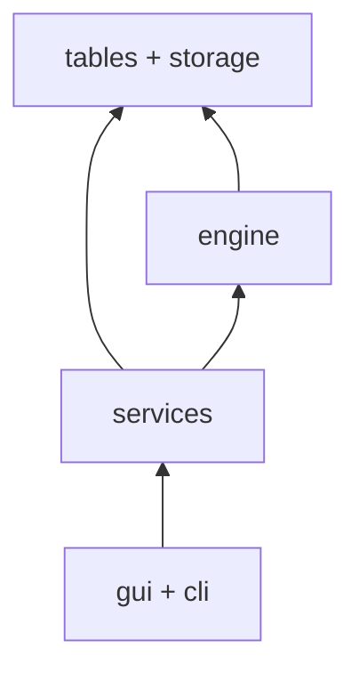

# Слои Stanok и их границы

Правило зависимости: **gui/cli → services → engine**; внутрь — можно,
наружу и вбок — нельзя. Нарушение = падение CI (`tests/test_layers.py`,
вопрос 3 в `arhitecture.md`).



## Слой engine (`src/stanok/engine/`) — чистый Python
- Знает: типы PJ/AJ/FJ, таблицы-как-строки, XML.
- НЕ знает: Qt, диалоги, пути Home, Excel-файлы напрямую (только через
  `tables/`-бэкенд, инжектированный вызывателем), сеть.
- Запрещены импорты: `PyQt5`, `stanok.gui`, `stanok.cli`, `os.path` с
  пользовательскими каталогами (только переданные пути).
- Тест границы: `import stanok.engine` не тянет Qt; grep-гейт в CI.

## Слой services (`src/stanok/services/`) — use cases
- Знает: engine + storage-интерфейсы.
- НЕ знает: Qt-виджеты, argv (это дело cli/gui).
- Один публичный use case — одна функция с типизированными входом/выходом
  (M2, M6): `generate_documents(cmd) -> Report`, где `cmd` — dataclass,
  не 7 позиционных аргументов.
- Ошибки — типизированные (`ProjectNotFound`, `NoData`), не сырые
  исключения движка наружу без обёртки с контекстом.

## Слой gui/cli — тонкие адаптеры
- Знают: services + STRINGS (единый модуль строк, M4).
- НЕ знают: engine напрямую (только типы для аннотаций — `TYPE_CHECKING`),
  файловые пути проектов (только через `storage`).
- QMessageBox — только здесь; в services/cli — коды ошибок + logging
  (правило логгирования из FirstAgent сохраняется).

## Инфраструктура (`tables/`, `storage`, `~/.stanok/`)
- `tables/excel.py`: единственное место чтения Excel (M5).
- `storage`: единственное место файловых операций (уникальные имена,
  атомарная запись, миграции) (M1, M4, M11).
- Путь Home (`~/.stanok/`) — одна константа в `storage`, инжектируется
  в тестах через tmp (M4, M11).

## Поток данных (сквозной пример: «Сгенерировать»)
```
GUI --GenerateCommand--> services.generate
  --read--> tables/excel (строки)
  --resolve--> engine.resolve (Filling JSON × N)
  --render--> engine.render (docx × N, pure)
  --write--> storage (Результат/, уникальные имена)
GUI <--Report-- (создано N, пропущено M + причины)
```
Excel пересекает границу ровно один раз; назад (в GUI) возвращаются только
отчёт и пути файлов, не сырые строки.
