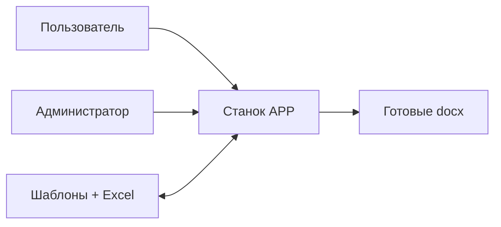
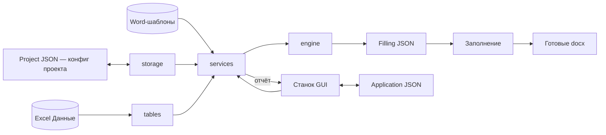
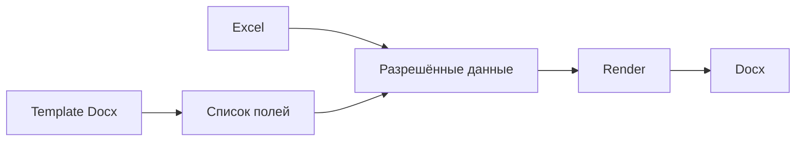

# Спецификация: Проект "Станок"

**Статус:** Active
**Версия:** 0.0.0
**Автор:** Kirill Borovoy
**Ревьюеры:** -
**Создано:** 2026-09-20
**Обновлено:** 2026-10-05

---

## 1. Обзор

### 1.1 Назначение
Автоматизация работы с шаблонными документами: по docx-шаблону создать
необходимое количество документов, подставив данные из локальных таблиц
(Excel), даты и счётчики.

### 1.2 Границы (Scope)
- **Входит:** генерация docx по шаблонам; заполнение шаблонов данными из
  локальных Excel-таблиц; счётчики и даты; пакетные режимы с продолжением.
- **Не входит:** подпись документов; отправка документов; PDF и другие
  выходные форматы; облачные источники данных; многопользовательский режим;
  автообновление приложения, изображения, статистика, CLI; не позволяет
  сотруднику генерировать новые проекты из данных.

### 1.3 Пользователи / Акторы
| Актор         | Роль                | Контекст использования          |
|---------------|---------------------|---------------------------------|
| Пользователь  | создание документов | ежедневное написание документов |
| Администратор | создание шаблонов   | по просьбе пользователя         |
| Разработчик   | создание программы  | реализация функционала          |

### 1.4 Контекст и проблема
**Отвечает на вопрос:** *Зачем мы это делаем?*

Содержимое:
- Пользователь тратит много времени на заполнение типичных документов данными из таблиц, датами и т.д.
- Реализован только каркас приложения (точка входа, упаковка); основной функционал — по FR ниже, системы тестирования пока нет.
- Ограничения: без доступа к интернету.

---

## 2. Требования

Приоритеты (Must/Should/Could)

### 2.1 Функциональные (FR)
| ID     | Требование                                                            | Приоритет |
|--------|-----------------------------------------------------------------------|-----------|
| FR-1   | Генерация docx-документов по шаблонам с плейсхолдерами (`{{ поле }}`) | Must      |
| FR-2   | Заполнение полей через GUI (константы, выбор таблицы и ее строк)      | Must      |
| FR-3   | Счётчики и поле текущей даты (today)                                  | Must      |
| FR-4   | Пакетные режимы обхода строк (sequential/circular/constant)           | Must      |
| FR-5   | Продолжение с места остановки (resume)                                | Must      |
| FR-6   | Шаблоны имён выходных файлов из значений полей                        | Must      |
| FR-7   | Несколько Excel-файлов как источники данных одного проекта            | Must      |
| FR-8   | Именованные конфиги `<имя>.stanok`, миграция в `~/.stanok`, резолвер   | Must      |
| FR-9   | Filling JSON как единственный вход рендера (валидация, понятные ошибки) | Must      |
| FR-10  | Битые конфиги/шаблоны/таблицы → диалог, не падение | Must      |
| FR-11  | Атомарная запись конфигов (tmp + `.bak`); версия формата = версии app  | Must      |
| FR-12  | Файловые операции создания: копирование `Данные/`/`Шаблоны/`, чекбокс «исключить копирование» | Must |
| FR-13  | Управление проектом: добавить/удалить шаблон, удалить проект целиком   | Must      |
| FR-14  | Папка без `*.stanok` → понятная ошибка (не падение, не молчание)        | Must      |
| FR-15  | Недавние проекты: список, переоткрытие, лимит 10                        | Should    |
| FR-16  | Фоновая генерация с прогрессом и отменой (GUI не виснет)                | Should    |
| FR-17  | Лимиты генерации: max_docs, auto-docs                                   | Should    |

### 2.2 Нефункциональные (NFR)
| ID    | Требование                                              | Как проверяется                          |
|-------|---------------------------------------------------------|------------------------------------------|
| NFR-1 | Полная работа без интернета (офлайн)                    | Запуск и генерация с отключённой сетью   |
| NFR-2 | Портативность: один exe без установки (PyInstaller)     | Запуск `Станок.exe` на чистой Windows    |
| NFR-3 | Русскоязычный интерфейс (все строки через STRINGS)      | Ревью строк, grep хардкода               |
| NFR-4 | Тестируемость: покрытие движка 85%+, багфикс → регрессионный тест | `pytest --cov`, хук pre-commit |
| NFR-5 | Диагностируемость: причина любой ошибки устанавливается по логу | Правило логгирования (уровень + exc_info + контекст), ревью except-блоков |
---

## 3. Архитектура и проектирование

### 3.1 Контекстная диаграмма (C4 Level 1)

### 3.2 Ключевые компоненты (детали: [docs/architecture.md](../docs/architecture.md))
| Компонент  | Ответственность                                                          | Технологии    |
|------------|--------------------------------------------------------------------------|---------------|
| `engine/`  | типы PJ/AJ/FJ, resolve (строки → Filling JSON); планируемые: render (FJ → docx, слияние run'ов), xmlops; чистый Python без Qt | Python |
| `tables/`  | единственное место чтения таблиц (Excel сейчас, csv позже)               | Python        |
| `services/`| use cases: storage (реализован, 005); планируемые: generate / projects / migrate; по одной функции на сценарий | Python |
| `gui/` | тонкий адаптер: окна → вызовы services, ноль бизнес-логики (планируется) | Python, PyQt5 |
| `~/.stanok`| всё состояние пользователя: мигрированные конфиги, лог, настройки        | JSON-файлы    |

> Правило: gui → services → engine (never vice versa, never sideways);
> движок не знает про Qt, диалоги, Home-пути и Excel-файлы напрямую.

### 3.3 Контейнеры (C4 Level 2)
| Контейнер      | Содержимое                                             | Назначение                                                          |
|----------------|--------------------------------------------------------|---------------------------------------------------------------------|
| `Станок.exe`   | GUI + движок                                           | Точка входа, один файл                                              |
| Файлы проекта  | `Данные/`, `Шаблоны/`, `<имя>.stanok`, `Результат/` | Вход, конфиг, выход                                                 |
| `~/.stanok` | мигрированные конфиги, лог, настройки приложения       | Всё состояние — в папке пользователя, рядом с exe ничего не пишется |

Поток данных (JSON-слой):

`Filling JSON` — разрешённые данные одного документа (`{поле: значение}` +
resolved `dist`); `Заполнение` — рендер по нему. Временный файл.
`Application JSON` (`~/.stanok/settings.json`) — список недавних проектов и
настройки приложения (шаблоны и счётчики живут в Project JSON, не в AJ).
`Project JSON` (`<имя>.stanok`) — конфиг проекта: шаблоны, поля,
пакетные источники, счётчики; лежит в `~/.stanok`.

---

## 4. Контракты интерфейсов

### 4.1 Файл проекта `<имя>.stanok`
JSON: шаблоны → поля (constant/table/counter/today), пакетные
источники (constant/sequential/circular + resume), шаблоны имён файлов.
Фиксированного имени файла нет; открытие — через резолвер
(папка → именованный → Home-копия `~/.stanok`).

### 4.2 Входные данные
- **Таблицы:** локальные Excel-файлы в папке `Данные/` проекта; первая строка —
  заголовки столбцов. Даты/счётчики вычисляются движком.
- **Шаблоны:** docx-файлы в папке `Шаблоны/` проекта с плейсхолдерами полей
  (`{{ поле }}`); форматирование и разрывы строк сохраняются при подстановке.

### 4.3 Выходные данные
Готовые `.docx` в папке `Результат/`; существующие файлы не перезаписываются
(переименование `файл (1)`, `файл (2)`, …).

### 4.4 Ошибки
| Ситуация | Поведение |
|----------|-----------|
| Битый конфиг/шаблон | Диалог ошибки, без падения |
| Нет данных для генерации | Предупреждение, генерации нет |
| Ошибка движка | Код ошибки + сообщение, лог в `~/.stanok/stanok.log` |

---

## 5. Поведение и бизнес-логика

### 5.1 Конвейер генерации

Шаблон даёт *какие* поля (имена плейсхолдеров), Excel/счётчики/даты — *чем*
их заполнить; JSON соединяет то и другое.

### 5.2 Алгоритмы / Правила
- **Правило 1:** TABLE → CONSTANT замораживается значением строки при создании проектов.
- **Правило 2:** Счётчик при создании из генерации растёт как при обычной (`last = last + created`).
- **Правило 3:** Существующий выходной файл не трогаем, создаваемый переименовываем.

### 5.3 Edge Cases
| Сценарий | Ожидаемое поведение |
|----------|---------------------|
| Шаблон удалён после открытия окна | Диалог-предупреждение, окно живо |
| Коллизия имени конфига в Home | `(1)`, `(2)`, существующий не трогаем |
| Разрыв строки перед полем | Не съезжает (`текст-текст{{поле}}`) |
| Пустой пакетный источник | Предупреждение, генерации нет |

---

## 6. Безопасность

Десктопное офлайн-приложение: сетевой поверхности, аутентификации и
пользовательских данных на сервере нет.
- [ ] Ввод: строгая валидация JSON-конфигов, sanitize имён файлов
- [ ] Секреты: `.env` никогда не коммитится (pre-commit: trufflehog3)
- [ ] Аудит: mutating-операции логируются в `~/.stanok/stanok.log`

---

## 7. Наблюдаемость (Observability)

### 7.1 Логирование
- Общий лог приложения: `~/.stanok/stanok.log` (RotatingFileHandler, переживает перезапуск)
- Ошибки GUI — диалогом пользователю + записью в лог
- Уровни: DEBUG, INFO, WARN, ERROR (модуль `logging`, не `print`)

---

## 8. Тестирование

### 8.1 Unit тесты
- Покрытие движка: **85%+** (`pytest --cov=stanok`)
- Багфикс → регрессионный тест (конвенция репозитория)
- Тестирование через JSON-слой: разрешённые данные документа (`Filling JSON`)
  задаются JSON-фикстурой напрямую, без сборки Excel — рендер проверяется
  изолированно от чтения таблиц

### 8.2 Интеграционные тесты
- Сквозные сценарии генерации на фикстурах
- Граница Excel → JSON: чтение типов, режимы строк, счётчики — отдельно от рендера

### 8.3 E2E / GUI тесты
- pytest-qt, headless (`QT_QPA_PLATFORM=offscreen` по умолчанию)
- Модальные диалоги мокаются; ручной чек-лист GUI — в задаче

---

## 9. Миграция и развёртывание

### 9.1 Миграция данных
- [ ] Ломающие изменения формата допустимы без смены версии, но фиксируются в CHANGELOG `[Unreleased]` с путём миграции
- [ ] Проекты предыдущей версии не читаются и не мигрируются (осознанный разрыв); папка без `*.stanok` даёт понятную ошибку, а не падение
- [ ] Rollback: git-ветки/теги, сборка воспроизводима флагами из README

### 9.2 План развёртывания
1. Сборка: `pyinstaller --onefile --windowed --name Станок --paths src run.py` (флаги — как в AGENTS.md)
2. Проверка `dist/Станок.exe` на чистой машине
3. Ручная раздача exe (автообновления нет — вне scope)

---

## 10. Открытые вопросы / Резерв

- [ ] Слой разрешённых JSON-данных: формат, границы, фазы внедрения
- [ ] Видимость чекбокса «Исключить копирование» только в режиме генерации
- [ ] GUI-флейки под нагрузкой (медленное чтение Excel) — JSON-фикстуры или ретраи
